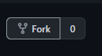
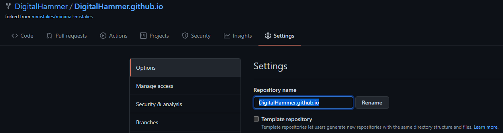

# Cybersecurity Profile Step-by-Step Guide

### *This guide assumes you already have a GitHub account made.* 
  - **Section One** demonstrates how to fork this repository and update the repo name to immediately get your GitHub Page live. 
  - **Section Two** points out specific configurations that need to be updated to personalize your page.
  - **Section Three** covers the format for creating posts (called "write-ups" in this template) and how projects can be displayed.
  - **Section Four** (optional) provides examples on how to customize the theme for your own aesthetic preferences.
---
## Section One: get your site live
### 1. Fork Repository
  - While in the GitHub repository https://github.com/DigitalHammer/cybersecurity-profile-template, select "Fork" on the top right of the screen

    

  - Select the GitHub account you want it forked to

### 2. Change Repo Name
  - Navigate to the "cybersecurity-profile-template" repo in your GitHub account
  - Click on settings displayed on the tabs below the repo name

    

  - Change the repository name to your GitHub account name followed by "github.io"
    * Change what is in the brackets but do not include the brackets: [YourGitHubName].github.io
    * Example: DigitalHammer.github.io

#### Once you change the repo name the site will update automatically. Give it about 10 minutes (potentially longer) and you'll be able to navigate to your own github.io site just like any other site. 

---
## Section Two: personalize it
### 1. 

---
## Section Three: format for posts and projects
### 1. 

--- 
## Section Four: design options
### 1. 
